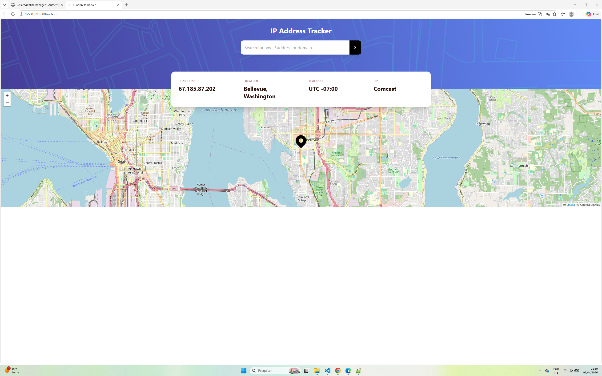

# Frontend Mentor - IP Address Tracker solution

This is my solution to the [IP Address Tracker challenge on Frontend Mentor](https://www.frontendmentor.io/challenges/ip-address-tracker-I8-0yYAH0). This project was a great way to practice handling asynchronous API calls and integrating third-party libraries like LeafletJS.

## Table of contents

- [Overview](#overview)
  - [The challenge](#the-challenge)
  - [Screenshot](#screenshot)
  - [Links](#links)
- [My process](#my-process)
  - [Built with](#built-with)
  - [What I learned](#what-i-learned)
  - [Useful resources](#useful-resources)

## Overview

### The challenge

Users should be able to:

- View the optimal layout for each device's screen size.
- See hover states for all interactive elements on the page.
- Get their own IP address and location on the initial page load.
- Search for any IP addresses or domains and see the key information and location.

### Screenshot

### Links

- Solution URL: [[GitHub](https://github.com/carolsalome/ip-tracker)]
- Live Site URL: [[Vercel](https://ip-tracker-zeta-orpin.vercel.app/)]

## My process

### Built with

- Semantic HTML5 markup
- **Tailwind CSS** - For a responsive and modern UI.
- **JavaScript (Vanilla)** - Handling API logic and DOM updates.
- **LeafletJS** - For the interactive map.
- **IPify Geolocation API** - To fetch coordinates and ISP data.

### What I learned

This project pushed me to think about UI layering. Specifically, positioning the results card so it overlaps both the header and the map required a solid understanding of absolute positioning and z-index management.

On the JavaScript side, I focused on making the search experience seamless. I implemented a form submit listener so that users can search by clicking the button or simply pressing "Enter". I also added error handling to manage invalid IP addresses or failed API requests without crashing the app.

### Useful resources

- [LeafletJS Docs](https://leafletjs.com/) - Essential for initializing the map and moving the view dynamically.
- [IPify API Documentation](https://geo.ipify.org/docs) - Very clear documentation on how to query data using both IPs and domain names.

## Author

- Frontend Mentor - [@carolsalome](https://www.frontendmentor.io/profile/carolsalome)